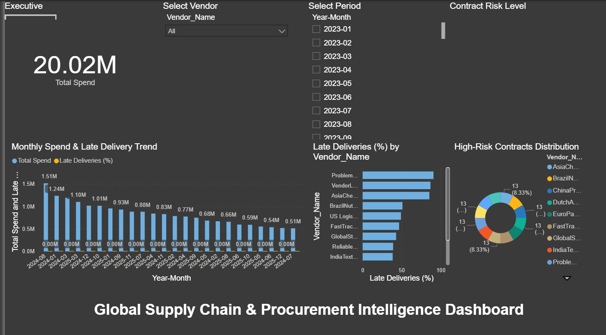
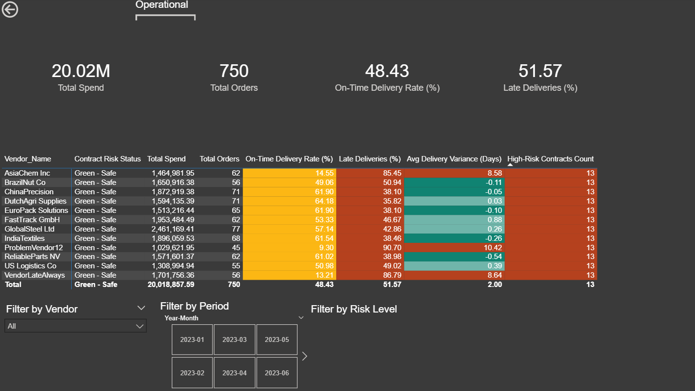
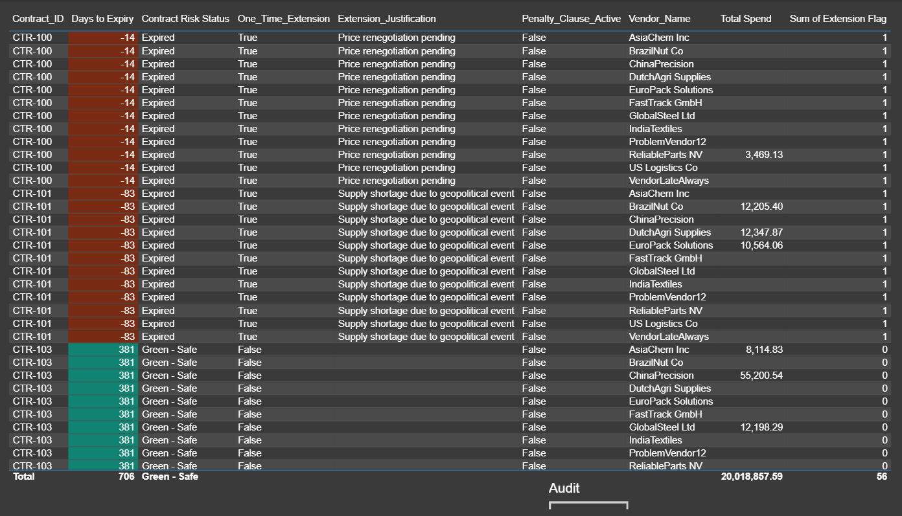

# Supply Chain & Procurement Intelligence Dashboard

Professional Power BI portfolio project demonstrating end-to-end supply chain analytics: synthetic data generation, ETL/modeling, proactive DAX alerting, and interactive RAG visualizations.

## Business Problem
Fragmented procurement, logistics, and contract data hides delivery bottlenecks, vendor reliability issues, and imminent contract expiries. This dashboard provides:
- Real-time spend & performance KPIs
- Proactive expiry risk alerts (Red/Amber/Green)
- Delivery variance & lateness analysis
- Audit-ready view of contract extensions & justifications

## Technical Stack
- **Data Generation**: Python (pandas + numpy) – ~750 realistic POs with injected noise, late vendors, and compliance risks
- **Storage**: CSV files in `/data/`
- **ETL & Modeling**: Power Query + Star Schema (Procurement fact table + Dim_Date calendar)
- **Intelligence**: DAX measures for lead time, on-time/late %, delivery variance, days-to-expiry, SWITCH-based RAG status
- **Visualization**: 3-page interactive dashboard with conditional formatting, slicers, trends
- **Version Control**: Git + GitHub

## Key Insights & How to Interpret Alerts
- **Red / Amber / Yellow** in Contract Risk Status → Urgent action needed (≤90 days to expiry)
- **Late Deliveries % > 20%** or **Avg Variance > 5 days** → Vendor underperformance (drill to POs)
- **High-Risk Contracts Count** → Number of contracts expiring soon (financial & compliance exposure)
- **Yellow background on extensions** → Review one-time justifications provided

## Dashboard Pages
1. **Executive Overview** – High-level KPIs, monthly trends, vendor breakdown  
   

2. **Operational Matrix** – Vendor-level performance with RAG conditional formatting  
   

3. **Contract Audit Trail** – Detailed contract view with extensions, justifications, penalties  
   

## Future Enhancements (Ideas)
- Publish to Power BI Service with scheduled refresh
- Add drill-through pages for PO-level detail
- Integrate real ERP API data
- Add bookmarks for guided storytelling

Built by Enrique – 2026